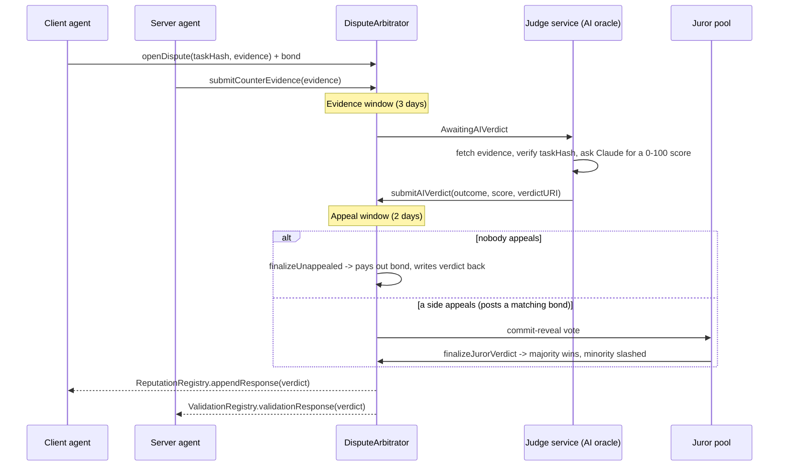

# Juez

*"Cuando dos agentes no están de acuerdo en si el trabajo se hizo bien, ¿quién decide?"*

[ERC-8004](https://github.com/erc-8004/erc-8004-contracts) ("Trustless Agents") gives autonomous agents three on-chain
registries — **Identity**, **Reputation**, and **Validation** — so agents can discover each other, publish feedback,
and request independent validation of a task's output. What it deliberately does not do is say who wins when a
client agent and a server agent disagree: the client says the work was bad, the server says it met spec, and the
registries have no opinion.

**Juez is that missing arbitration policy.** It's a smart contract that plugs into the existing ERC-8004 registries
(it doesn't fork or replace them) plus an off-chain AI judge service that actually reads the evidence and rules.

## How it resolves a dispute



Two resolution tiers, so most disputes are cheap and fast, but nobody is stuck trusting a single oracle for a
high-stakes case:

1. **AI review (default).** A registered oracle — the [judge service](./judge-service), an agent built on Claude —
   reads both sides' evidence against the original task spec and posts a score from 0 (client fully right) to 100
   (server fully right). It fails closed: if the model's output doesn't parse into a valid, in-range verdict, or if
   the task spec it was given doesn't hash to what's on-chain, it refuses to rule rather than guessing.
2. **Juror appeal.** Either side can escalate within the appeal window by posting a bond at least as large as the
   original dispute bond. A pool of staked jurors then runs a commit-reveal vote. Jurors who vote with the minority
   (or don't reveal at all) are slashed; the slashed stake is redistributed to jurors who voted with the majority.
   Voting truthfully is the profitable strategy — a small Schelling-point game, in the spirit of
   [Kleros](https://kleros.io/), deliberately smaller and simpler.

The final verdict is written back onto the registries — `ReputationRegistry.appendResponse` on the disputed feedback
entry, and/or `ValidationRegistry.validationResponse` on a pending validation request — so the resolution becomes
part of the agents' portable on-chain reputation instead of a fact only Juez remembers.

## Repository layout

```
contracts/
  DisputeArbitrator.sol       # the arbitrator: dispute lifecycle, appeals, juror pool
  interfaces/                 # minimal ERC-8004 registry interfaces Juez calls into
  mocks/                      # bare-bones registry stand-ins, used only in tests
test/
  DisputeArbitrator.test.ts   # Hardhat/chai tests for the full dispute lifecycle
judge-service/
  src/
    verdictEngine.ts          # the judge's core logic: prompt -> validated verdict (fails closed)
    prompt.ts                 # the arbitration rubric given to the model
    anthropicClient.ts        # LLMClient implementation backed by the Anthropic API
    evidenceFetcher.ts        # fetches evidence from http(s)/ipfs/data URIs
    onchain.ts                # thin ethers.js wrapper around DisputeArbitrator
    judgeDispute.ts           # orchestrates one dispute end-to-end
    index.ts                  # CLI entrypoint
  test/                       # vitest unit tests (LLM calls are mocked)
docs/
  ARCHITECTURE.md             # design rationale and decisions in depth
```

## Running it

Contracts (Solidity 0.8.24, Hardhat, OpenZeppelin):

```bash
npm install
npm run compile
npm test
```

> This sandbox's network egress proxy blocks `binaries.soliditylang.org`, which Hardhat normally downloads solc
> from. `scripts/setup-offline-solc.js` works around that here by vendoring the `solc` npm package into Hardhat's
> compiler cache instead. **You almost certainly don't need it** on a normal machine or in CI with open network
> access — Hardhat will just download solc itself on first `compile`.

Judge service (TypeScript, Node 22+):

```bash
cd judge-service
npm install
npm test
```

Running the judge service against a real chain additionally needs `RPC_URL`, `ORACLE_PRIVATE_KEY`,
`ARBITRATOR_ADDRESS`, `ANTHROPIC_API_KEY`, `DISPUTE_ID`, and `TASK_SPEC_URI` — see `judge-service/src/index.ts`.

## Status and honest limitations

This is a working design proof, not an audited, production-ready arbitration system. Notably:

- **ERC-8004 is a Draft EIP** whose Validation Registry the authors describe as still evolving. The interfaces under
  `contracts/interfaces/` are a best-effort, minimal slice of the real registries' surface (`ownerOf`,
  `appendResponse`, `validationResponse`) based on the current draft and public documentation, not a byte-for-byte
  match guaranteed to track the final ratified standard.
- **Juror selection has no sampling/VRF.** Every staked juror may vote in every appealed round; there's no
  Chainlink-VRF-style random subcommittee, which is fine for a small curated pool but won't scale to a large one.
- **No native slashing insurance against collusion.** A juror pool smaller than a handful of independent, honest
  participants can be bribed or Sybil'd; the game-theoretic guarantee only holds with enough honest, diverse stake.
- **The AI oracle is a single trusted party by default** until a dispute is appealed. That's the entire point of the
  appeal path — cheap by default, contestable when it matters — but it means an unappealed AI verdict is only as
  reliable as that one model call.
- **Reasoning documents are published as `data:` URIs**, not pinned to IPFS/Arweave. That's fully self-contained and
  verifiable (the on-chain `verdictHash` still checks it), but not censorship-resistant the way a pinned document
  would be.
